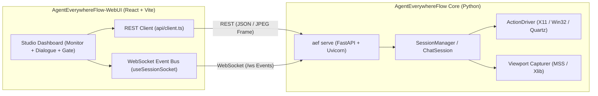

<div align="center">

# 🌐 AgentEverywhereFlow WebUI (`AEF Studio`)

**Universal, Modern, Viewport-Isolated Web Console for Embodied Desktop Agents**

[](https://github.com/mcocdaa)
[](https://github.com/mcocdaa/AgentEverywhereFlow-WebUI/actions)
[](LICENSE)
[](package.json)
[](package.json)
[](https://github.com/mcocdaa/AgentEverywhereFlow)

</div>

---

## 📖 Overview

**AgentEverywhereFlow WebUI** is the official standalone web frontend companion for [AgentEverywhereFlow](https://github.com/mcocdaa/AgentEverywhereFlow). 

Designed with a strict **"Headless Core + Independent WebUI"** philosophy:
- The core Python library `AgentEverywhereFlow` remains completely lightweight, clean, API-first, and CLI-first with **zero GUI/Electron dependencies**.
- This WebUI runs anywhere (browser, desktop tablet, remote laptop) and connects seamlessly to `aef serve` via **REST API** (`http://127.0.0.1:8000/api/v1`) and high-throughput bidirectional **WebSockets** (`ws://127.0.0.1:8000/api/v1/sessions/{id}/ws`).

---

## ✨ Key Features

- 🖥️ **Isolated Viewport Live Monitor**:
  - Live capture feed matching the exact pixel coordinate contract `(0, 0, width, height)` of the target window/screen.
  - Real-time cursor coordinates HUD displaying relative target `(x, y)` on mouse hover.
  - Dynamic radar ripple markers visualising agent action coordinates in real-time.
  - Fullscreen expansion and manual/automatic snapshot refresh.

- 💬 **Multi-Turn Dialogue & CoT Stream**:
  - Continuous dialogue turn support with instruction history.
  - Collapsible **Chain-of-Thought (CoT)** reasoning blocks.
  - High-visibility CodeAct blocks displaying executable Python snippets and tool outputs.

- 🛡️ **Human-in-the-Loop Security Gate**:
  - Toggle between **Autonomous (`AUTO`)** and **Supervised (`MANUAL`)** modes at runtime.
  - Floating approval gate for operator confirmation before executing OS input injection (clicks, keypresses).
  - Ability to provide instant feedback or rejection reasons to re-orient the agent.

- 🎯 **Visual Target Discovery & Session Switcher**:
  - Discover active windows and screens with one click.
  - Filter targets by Window vs Display with process metadata, dimensions, and minimization status.
  - Switch target or start multiple concurrent sessions effortlessly.

- 📦 **One-Click Workflow & Trace Export**:
  - Export session actions into **standalone, runnable Python automation scripts** (`.py`) leveraging `agenteverywhereflow.actions.driver`.
  - Export complete audit reports in **Markdown** (`.md`).
  - Export raw execution traces in structured **JSON** (`.json`).

---

## 🏗️ Architecture



---

## 🚀 Quick Start

### 1. Start the Backend Service
Make sure `agenteverywhereflow` is installed in your Python environment:
```bash
# In the AgentEverywhereFlow repository
uv run aef serve --host 127.0.0.1 --port 8000
```

### 2. Launch the WebUI Console
```bash
# Clone the WebUI repository
git clone git@github.com:mcocdaa/AgentEverywhereFlow-WebUI.git
cd AgentEverywhereFlow-WebUI

# Install dependencies (pnpm recommended)
pnpm install

# Start development server
pnpm dev
```

Open your browser at `http://localhost:5173` to access the console!

---

## 🛠️ Build & Verification

```bash
# Type check and build production bundle
pnpm build

# Lint with Oxlint
pnpm lint

# Preview production build locally
pnpm preview
```

---

## 📄 License

MIT License. Part of the `*Flow` ecosystem. See [LICENSE](LICENSE) for details.
